# Sequence Diagram

---

- [1. 상품 검색](#1-%EC%83%81%ED%92%88-%EA%B2%80%EC%83%89)
- [2. 상품 상세 조회](#2-%EC%83%81%ED%92%88-%EC%83%81%EC%84%B8-%EC%A1%B0%ED%9A%8C)
- [3. 인기 상품](#3-%EC%9D%B8%EA%B8%B0-%EC%83%81%ED%92%88)
- [4. 주문 / 결제](#4-%EC%A3%BC%EB%AC%B8--%EA%B2%B0%EC%A0%9C)
- [5. 잔액](#5-%EC%9E%94%EC%95%A1)
- [6. 선착순 쿠폰](#6-%EC%84%A0%EC%B0%A9%EC%88%9C-%EC%BF%A0%ED%8F%B0)
- [7. 장바구니](#7-%EC%9E%A5%EB%B0%94%EA%B5%AC%EB%8B%88)

---

### 1. 상품 검색

> 상품명, 카테고리, 가격 범위, 인기순 등의 조건으로 상품 검색 시 상품 목록을 반환한다.

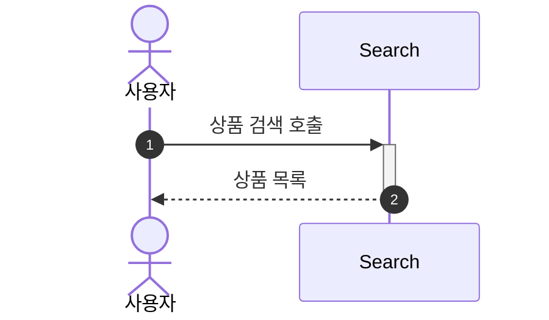

---

### 2. 상품 상세 조회

> 상품 ID로 상품 정보(이름, 가격, 잔여 수량 등)를 조회 한다.

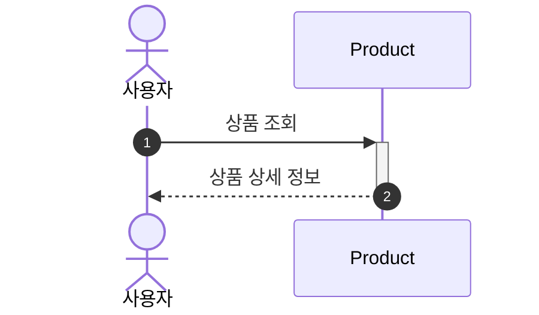

---

### 3. 인기 상품

#### 인기 상품 목록 조회

> Cache 처리 되어있는 인기 상품 목록을 조회 한다.

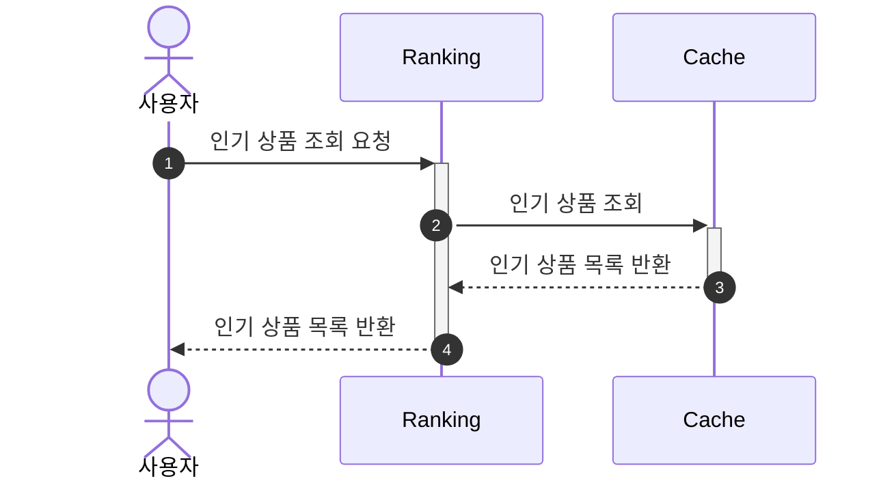

#### 인기 상품 목록 생성

> 배치 작업이 매 00시 마다 실행되어 인기 상품(최근 3일간 판매량 기준, 가장 많이 팔린 상위 5개 상품) 데이터를 생성한다.

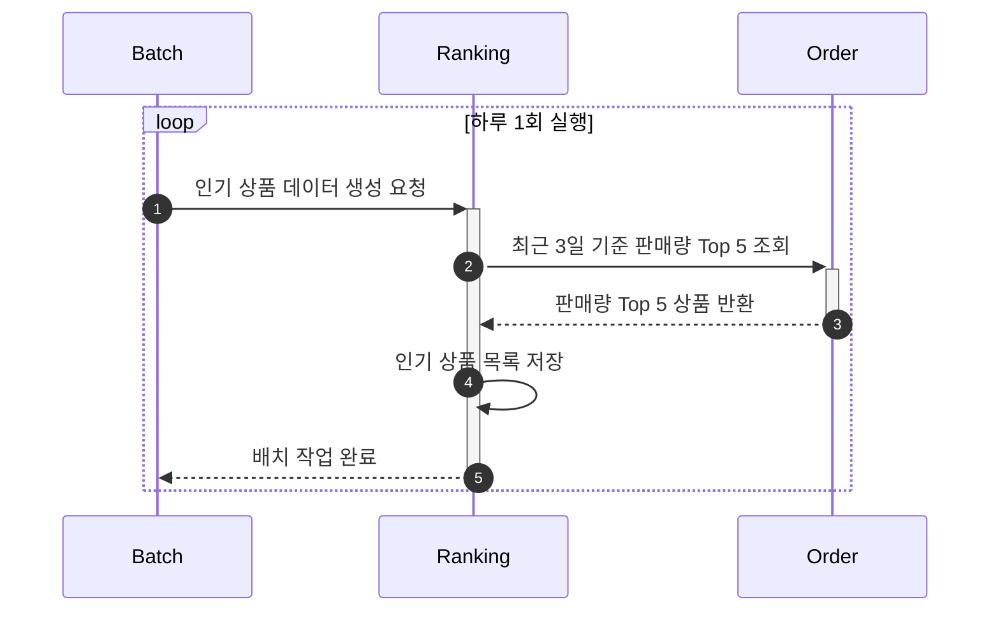

---

### 4. 주문 / 결제

#### 주문 생성

> 회원 식별자와 장바구니 정보, 쿠폰 식별자를 입력받아 주문을 생성.

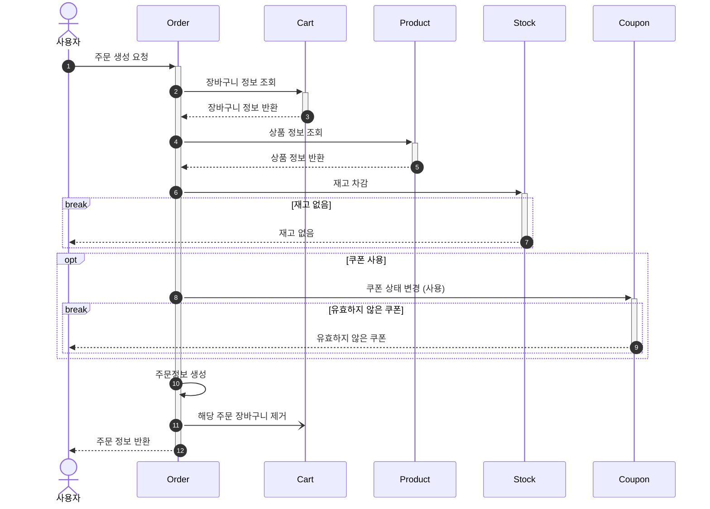

#### 결제 요청

> 생성된 주문 정보로 결제를 요청한다.

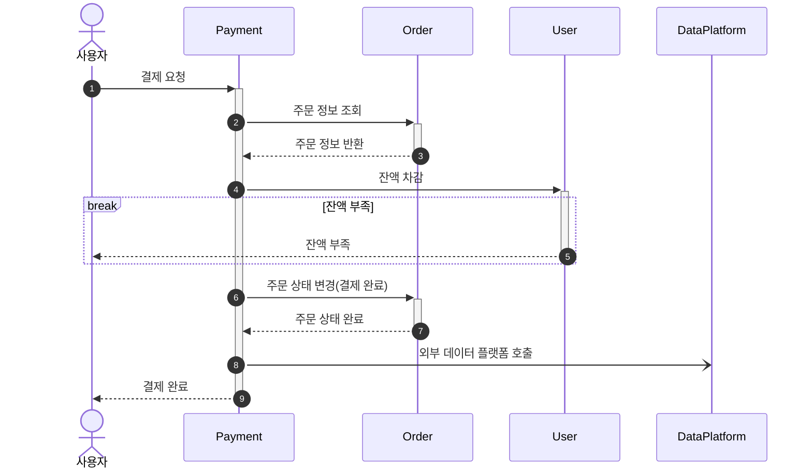

#### 결제 취소

> 생성된 주문/결제 정보를 취소 처리한다.

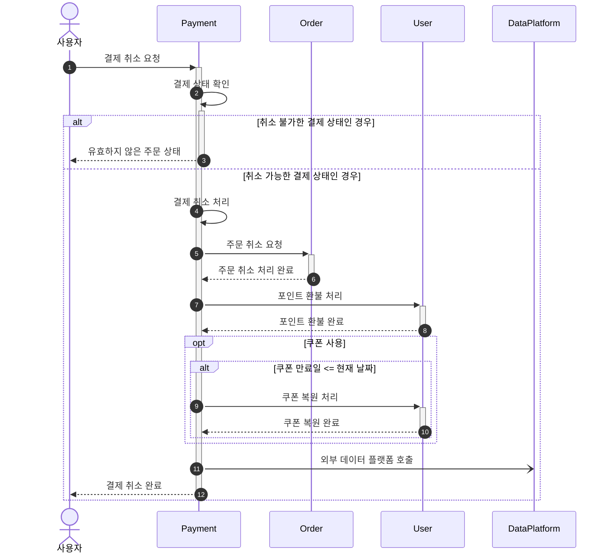

---

### 5. 잔액

#### 잔액 충전

> 회원 식별자를 통해 결제에 사용할 금액(포인트)을 충전 할 수 있음

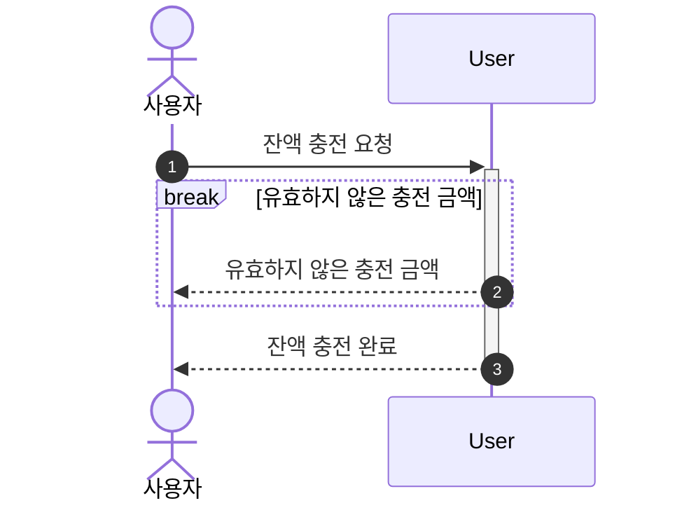

#### 잔액 조회

> 충전된 포인트의 잔액을 실시간으로 조회 가능

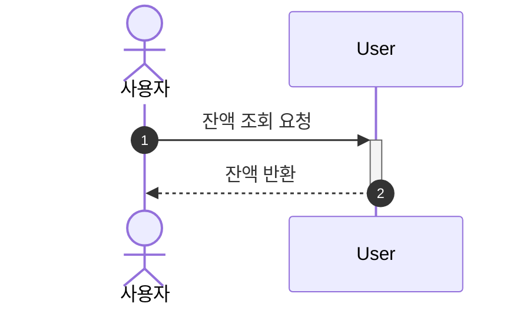

---

### 6. 선착순 쿠폰

- **금액 할인 쿠폰**(예: 5,000원 할인)과 **정률 할인 쿠폰**(예: 10% 할인) 제공
- 제한된 수량만 **선착순** 발급 가능
- 발급받은 쿠폰 목록을 조회하고, **주문 시 쿠폰을 사용**하여 전체 금액 할인 가능

#### 발급 쿠폰 목록 조회

> 사용자가 발급 받은 쿠폰 목록을 조회한다.

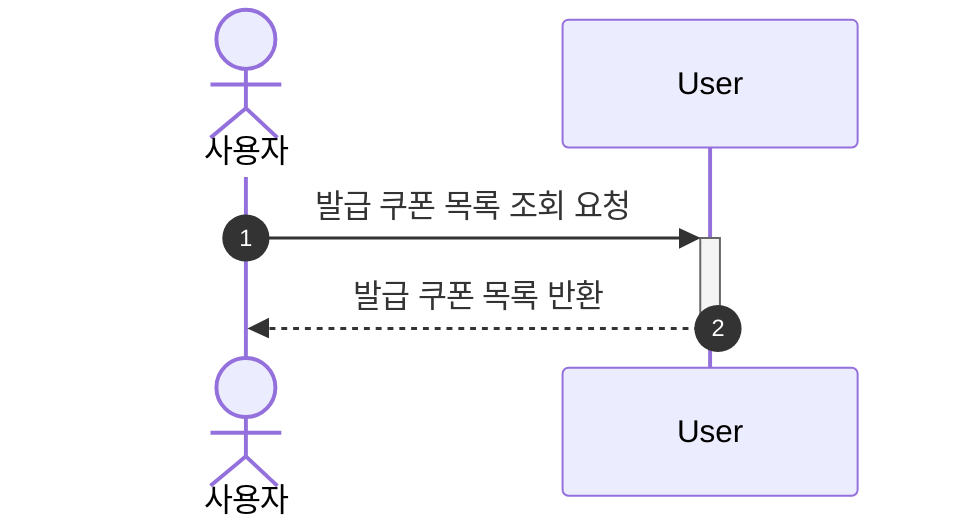

#### 선착순 쿠폰 발급

> 선착순 쿠폰을 발급 받는다.

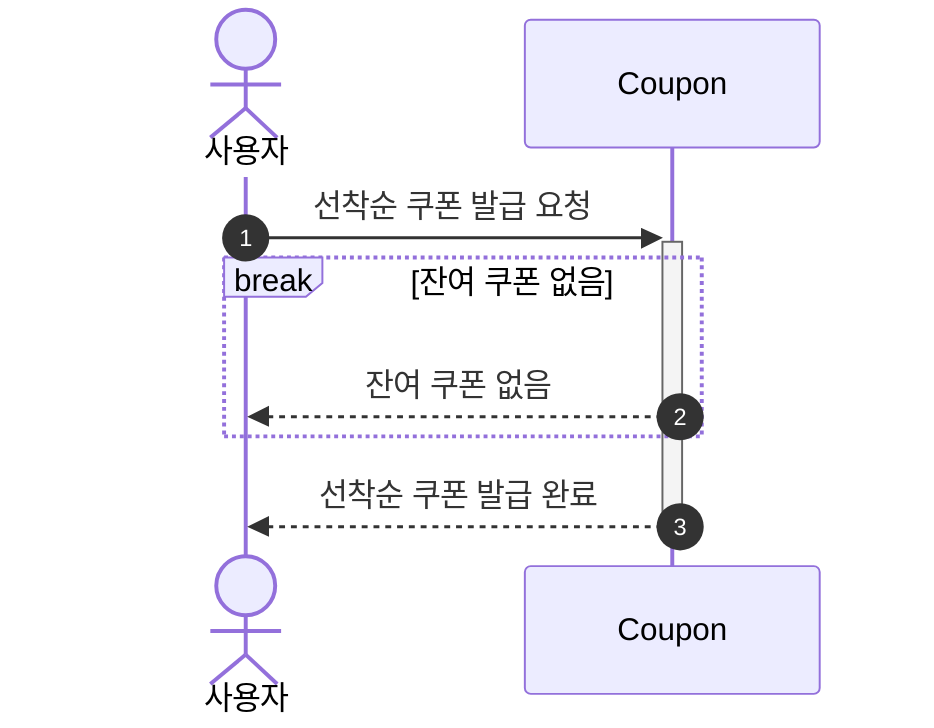

---

### 7. 장바구니

#### 장바구니에 상품 추가

> 회원/비회원 상품을 장바구니에 추가 한다.

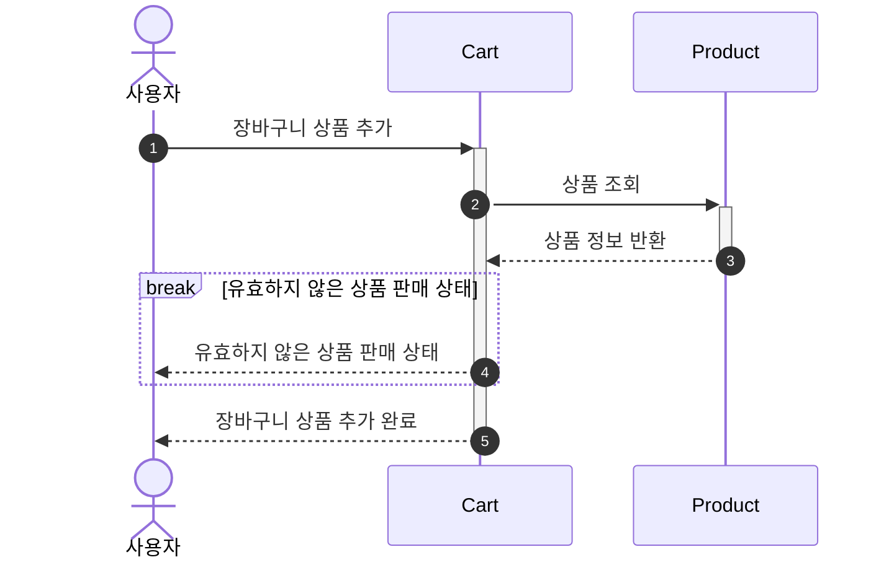

#### 장바구니 조회

> 회원/비회원의 장바구니를 조회 한다.

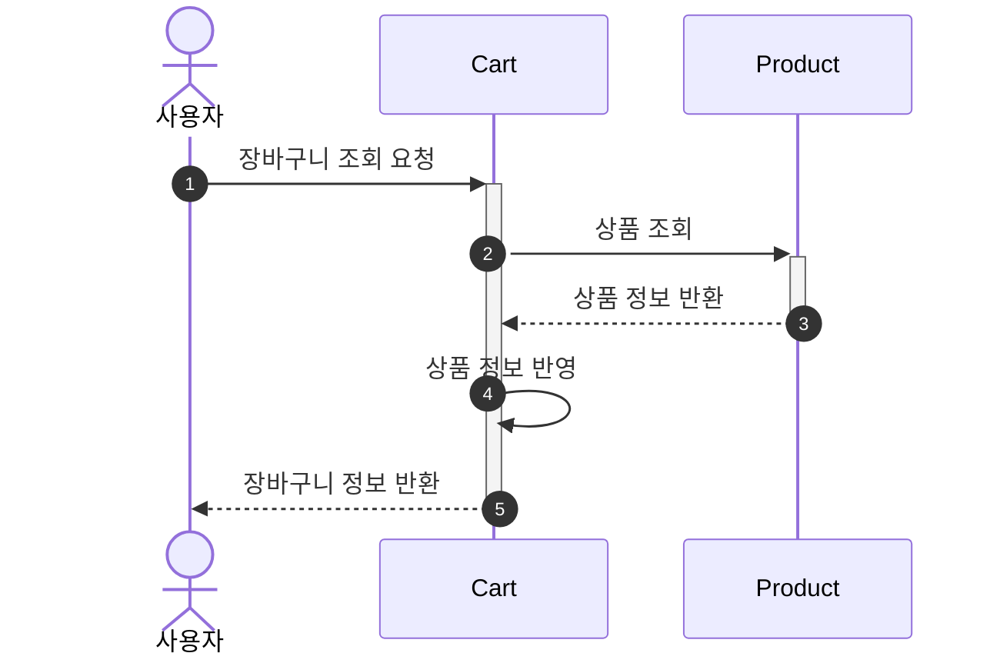

#### 장바구니 상품 삭제

> 회원/비회원의 장바구니를 삭제한다.

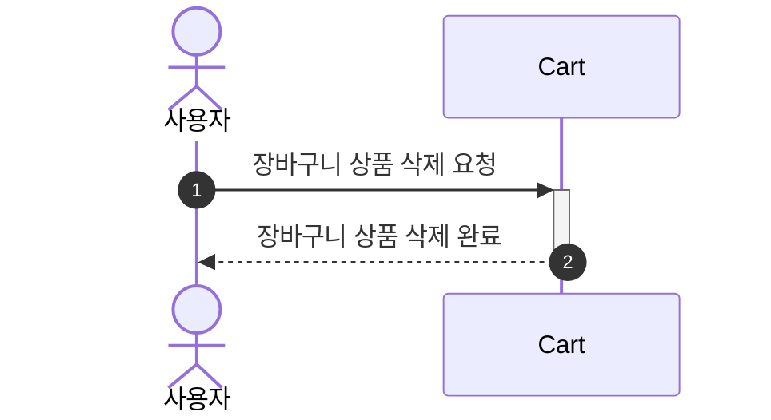

#### 비회원 장바구니 병합

> 비회원이 담은 장바구니는 로그인 시 해당 회원의 장바구니로 병합한다.

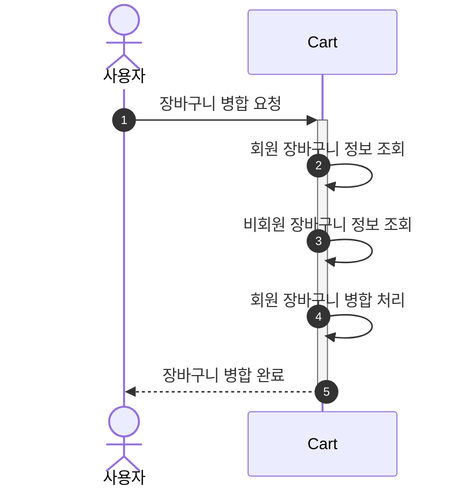
